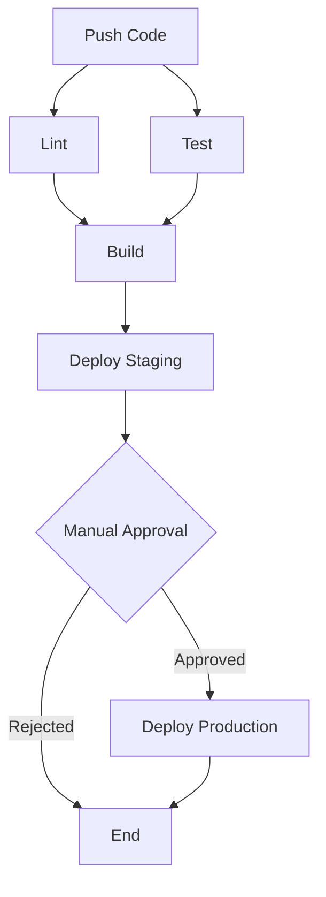

# Lesson Materials

This directory contains presentation materials for the CI/CD workshop.

## Contents

### slides.pdf
Workshop presentation slides covering:
- Introduction to CI/CD concepts
- GitHub Actions basics
- Pipeline design
- Best practices
- Real-world examples

### CI/CD Pipeline Visualization

The workshop materials include a visual representation of the CI/CD pipeline flow:

This diagram shows the complete pipeline stages from code push through production deployment.

