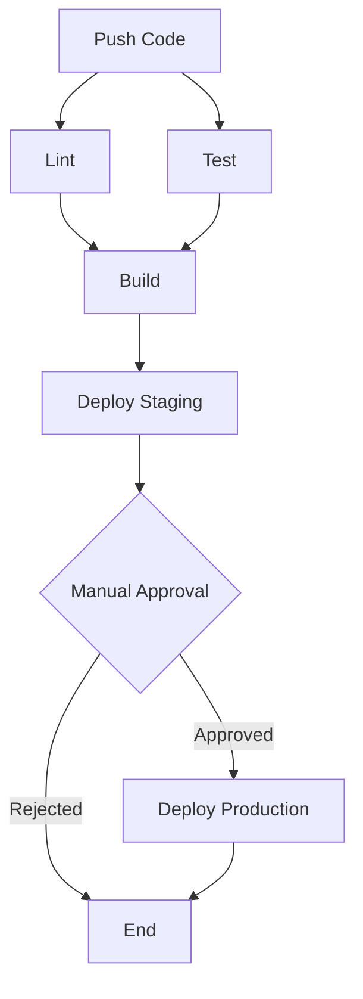

# Lesson Materials

This directory contains presentation materials for the CI/CD workshop.

## Contents

### slides.pdf
Workshop presentation slides covering:
- Introduction to CI/CD concepts
- GitHub Actions basics
- Pipeline design
- Best practices
- Real-world examples

**Note:** This is a placeholder. Add your actual presentation slides here.

### ci-cd-pipeline-diagram.png
Visual diagram showing:
- Pipeline stages
- Job dependencies
- Deployment flow
- Rollback strategies

**Note:** This is a placeholder. Add your actual pipeline diagram here.

## Creating These Materials

### For slides.pdf:
You can create slides using:
- Google Slides (export as PDF)
- PowerPoint (save as PDF)
- Keynote (export as PDF)
- LaTeX Beamer
- Reveal.js or Markdown-based slides

### For ci-cd-pipeline-diagram.png:
You can create diagrams using:
- Draw.io (diagrams.net)
- Lucidchart
- Mermaid diagrams
- PlantUML
- Excalidraw

### Example Mermaid Diagram

You can create a pipeline diagram using Mermaid in your README or slides:

This will render as a flowchart showing the CI/CD pipeline stages.

